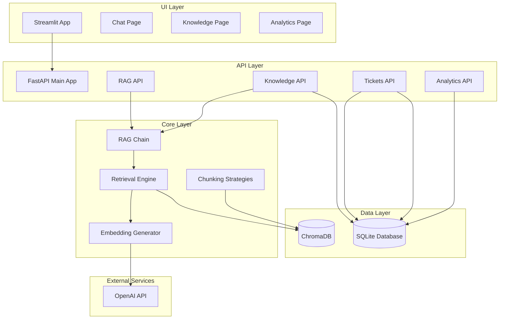
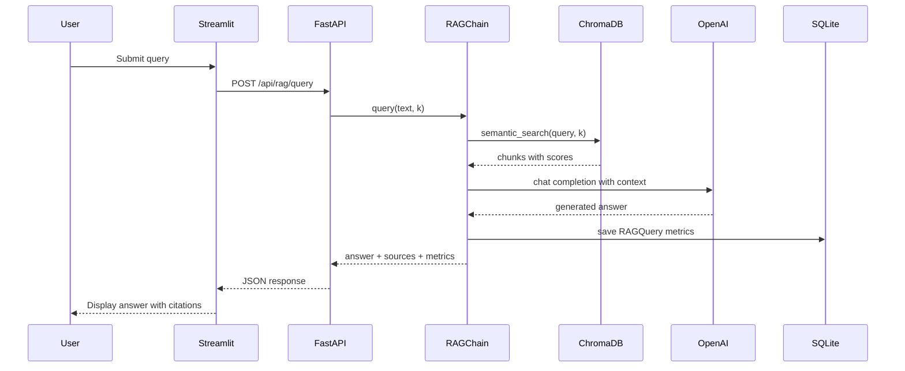
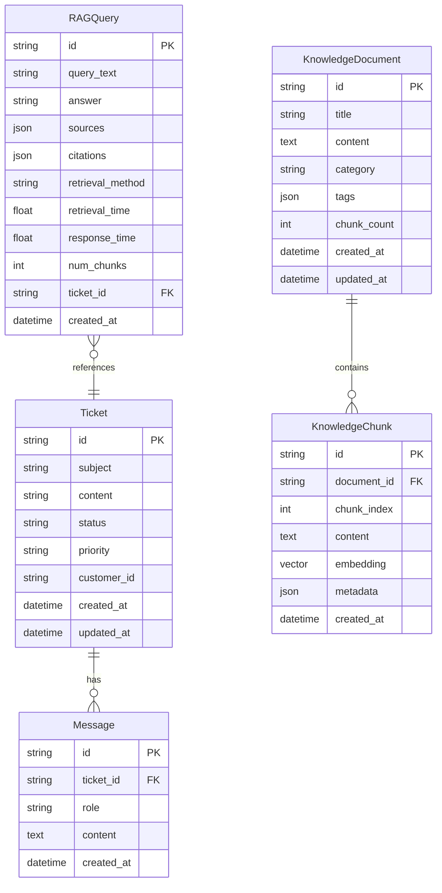

# RAG Customer Support System - Implementation Plan

## Project Overview

A Python-based Retrieval-Augmented Generation (RAG) system for customer support, featuring:
- Document ingestion with multiple chunking strategies
- Semantic search using ChromaDB and OpenAI embeddings
- RAG-powered query responses with source citations
- Ticket management system
- Analytics dashboard
- Streamlit UI for easy interaction

## System Architecture



## Data Flow Diagram



## Database Schema



## Technology Stack

| Component | Technology | Version |
|-----------|-----------|---------|
| Web Framework | FastAPI | 0.104.1 |
| ASGI Server | Uvicorn | 0.24.0 |
| ORM | SQLAlchemy | 2.0.23 |
| LLM Framework | LangChain | 0.1.0 |
| LLM Provider | OpenAI | 1.7.2 |
| Vector Database | ChromaDB | 0.4.18 |
| UI Framework | Streamlit | 1.29.0 |
| Data Processing | Pandas | 2.1.4 |
| ML Library | scikit-learn | 1.3.2 |
| Numerical Computing | NumPy | 1.24.3 |
| Validation | Pydantic | 2.5.0 |

## Project Structure

```
python-rag-system/
├── app/
│   ├── __init__.py
│   ├── main.py                          # FastAPI application entry point
│   ├── api/
│   │   ├── __init__.py
│   │   ├── rag.py                       # RAG query endpoint
│   │   ├── knowledge.py                 # Document ingestion/listing
│   │   ├── tickets.py                   # Ticket management
│   │   └── analytics.py                 # Analytics endpoint
│   ├── core/
│   │   ├── __init__.py
│   │   ├── rag.py                       # RAG chain implementation
│   │   ├── retrieval.py                 # ChromaDB retrieval engine
│   │   ├── chunking.py                  # Text chunking strategies
│   │   └── embeddings.py                # OpenAI embedding generation
│   ├── db/
│   │   ├── __init__.py
│   │   ├── models.py                    # SQLAlchemy models
│   │   └── session.py                   # Database session management
│   └── ui/
│       ├── streamlit_app.py             # Streamlit main app
│       └── pages/
│           ├── chat.py                  # Chat interface
│           ├── knowledge.py             # Knowledge base management
│           └── analytics.py             # Analytics dashboard
├── data/
│   └── knowledge_base/                  # Sample markdown documents
├── requirements.txt                     # Python dependencies
├── .env                                 # Environment variables
└── README.md                            # Project documentation
```

## Implementation Phases

### Phase 1: Foundation (Prompts 1-3)
- Project structure setup
- Database models definition
- Session management

### Phase 2: Core RAG Components (Prompts 4-7)
- Embedding generation
- Text chunking strategies
- Retrieval engine
- RAG chain

### Phase 3: API Layer (Prompts 8-11)
- RAG query endpoint
- Knowledge management
- Ticket management
- Analytics

### Phase 4: UI Layer (Prompts 12-15)
- Streamlit main app
- Chat page
- Knowledge page
- Analytics page

### Phase 5: Integration (Prompts 16-20)
- Main FastAPI app
- Sample documents
- Documentation
- Testing
- Final verification

## Key Design Decisions

### 1. Chunking Strategies
- **FixedSizeChunker**: Fixed 512 tokens with 50 token overlap
- **SemanticChunker**: Paragraph-based splitting for semantic coherence

### 2. Embedding Model
- OpenAI `text-embedding-3-small` for cost-effective embeddings
- Cosine similarity for relevance scoring

### 3. LLM Model
- OpenAI `gpt-3.5-turbo` for response generation
- System prompt enforces source citations

### 4. Vector Database
- ChromaDB for efficient similarity search
- Collection name: "knowledge_base"

### 5. Database
- SQLite for simplicity and portability
- Thread-safe connection handling

### 6. API Design
- RESTful endpoints with proper HTTP status codes
- Pydantic models for request/response validation
- Dependency injection for database sessions

## Environment Variables

```env
OPENAI_API_KEY=your_openai_key_here
DATABASE_URL=sqlite:///./rag_system.db
CHROMA_HOST=localhost
CHROMA_PORT=8000
```

## API Endpoints

| Method | Endpoint | Description |
|--------|----------|-------------|
| POST | /api/rag/query | Query RAG system |
| POST | /api/knowledge/ingest | Ingest document |
| GET | /api/knowledge/documents | List documents |
| POST | /api/tickets | Create ticket |
| GET | /api/tickets | List tickets |
| GET | /api/tickets/{id}/messages | Get ticket messages |
| POST | /api/tickets/{id}/messages | Add message |
| GET | /api/analytics/overview | Get analytics |

## Running the System

### Start FastAPI Server
```bash
python app/main.py
# Server runs on http://localhost:8000
```

### Start Streamlit UI
```bash
streamlit run app/ui/streamlit_app.py
# UI runs on http://localhost:8501
```

## Testing Strategy

1. **Database Initialization**: Verify tables created
2. **Document Ingestion**: Test chunking and embedding generation
3. **RAG Query**: Verify retrieval and generation
4. **API Endpoints**: Test all endpoints
5. **Integration**: Full workflow test

## Error Handling

- Database operations: Rollback on failure
- API calls: Retry logic with exponential backoff
- ChromaDB: Graceful degradation on connection errors
- User input: Pydantic validation

## Security Considerations

- API keys stored in environment variables
- CORS middleware for cross-origin requests
- Input validation on all endpoints
- SQL injection prevention via SQLAlchemy ORM

## Performance Considerations

- Async operations for I/O-bound tasks
- Connection pooling for database
- Batch embedding generation
- Configurable retrieval count (k parameter)
